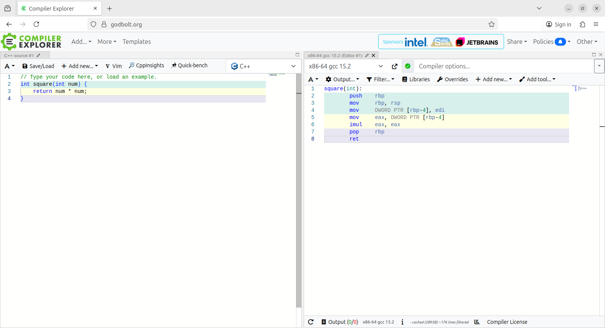
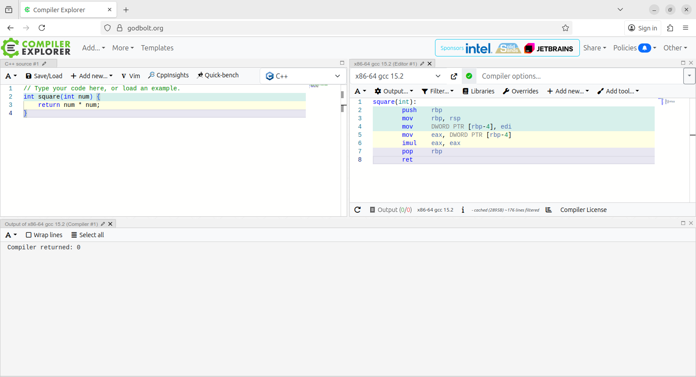
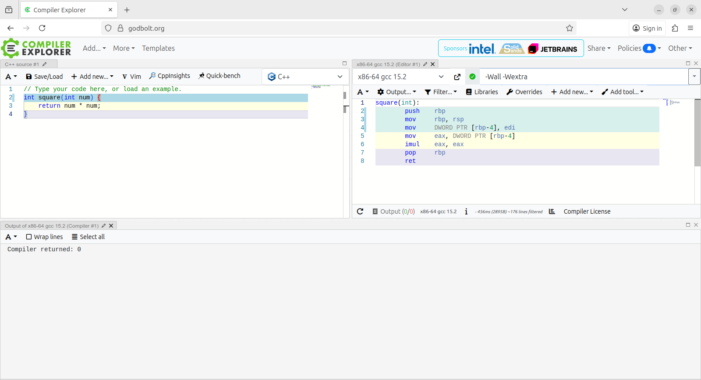
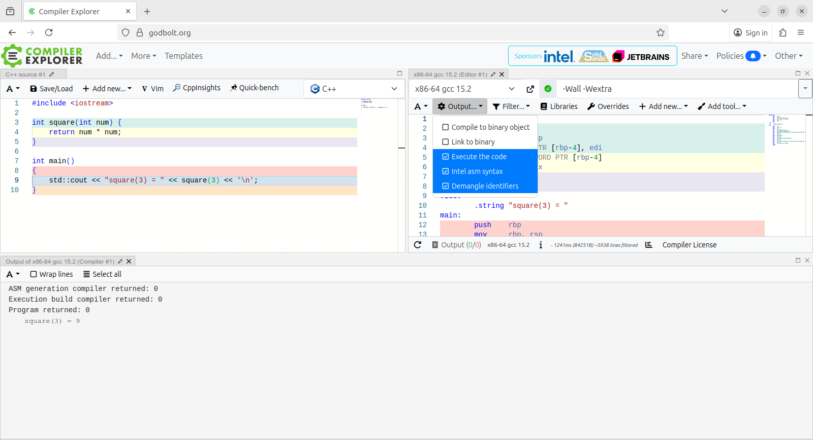

# Uso minimale di Compiler Explorer

[Compiler Explorer](https://godbolt.org) è uno strumento online molto utile per fare esperimenti e piccoli esercizi evitando l'uso di un editor e di un terminale sul proprio computer.

La pagina di default, una volta accettate le condizioni di utilizzo, si presenta così:

e consiste principalmente di due sezioni:

1. a sinistra si scrive del codice
1. a destra si vede il risultato della compilazione, sotto forma di codice _assembler_

La compilazione avviene in modo automatico mentre si scrive il codice nella sezione di sinistra.

Per vedere gli eventuali errori o warning prodotti dal compilatore è opportuno aprire anche la sezione "Output", cliccando con il mouse e trascinando leggermente verso l'altro il bottone "Output (0/0)" che si vede in basso nella sezione di destra. Si ottiene così una vista simile alla seguente:

E' possibile specificare opzioni di compilazione aggiungendole nel campo apposito in alto a destra, a fianco dell'indicazione del compilatore usato, come si vede nella seguente figura, in cui sono state indicate le opzioni `-Wall -Wextra`:

Infine, è anche possibile eseguire il codice prodotto, selezionando l'opzione "Execute the code", come si vede nella figura seguente. Naturalmente in tal caso è necessario definire il `main`.

In questa configurazione, come si vede, non è stata usata la lettura di dati da `std::cin`. Per farlo è necessario abilitare un _executor_. Lo si può fare selezionando "Execution only" o "Executor From This" nel menu "Add new...", disponibile sia nella sezione di sinistra che nella sezione di destra. Ma si possono fare molte cose senza leggere dati dall'input, quindi questa possibilità è meno utile di quanto si pensi.

Compiler Explorer offre molte altre funzionalità, a partire dalla scelta del compilatore da utilizzare o anche dello stesso linguaggio di programmazione. Integra inoltre molti strumenti, utili per un uso avanzato.
